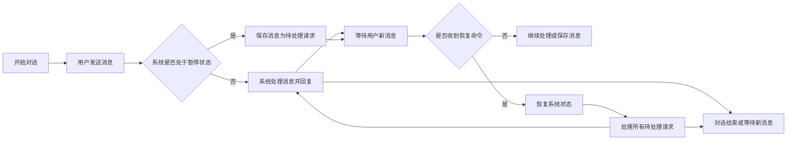
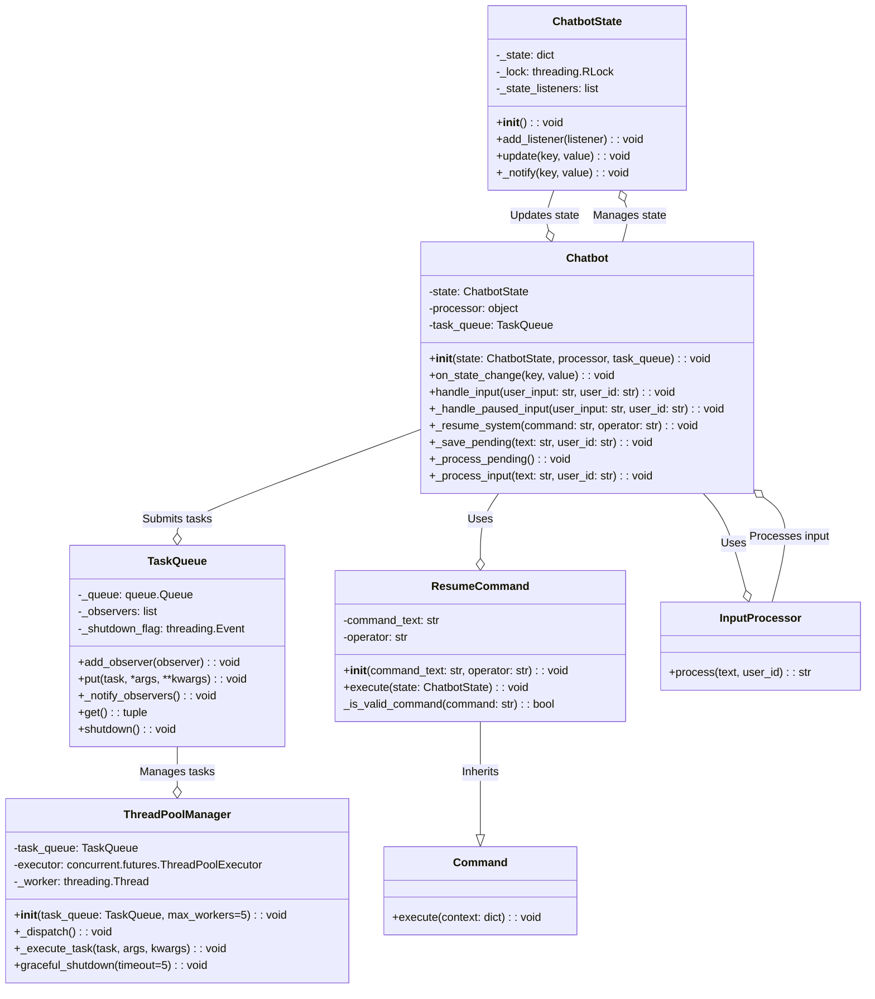
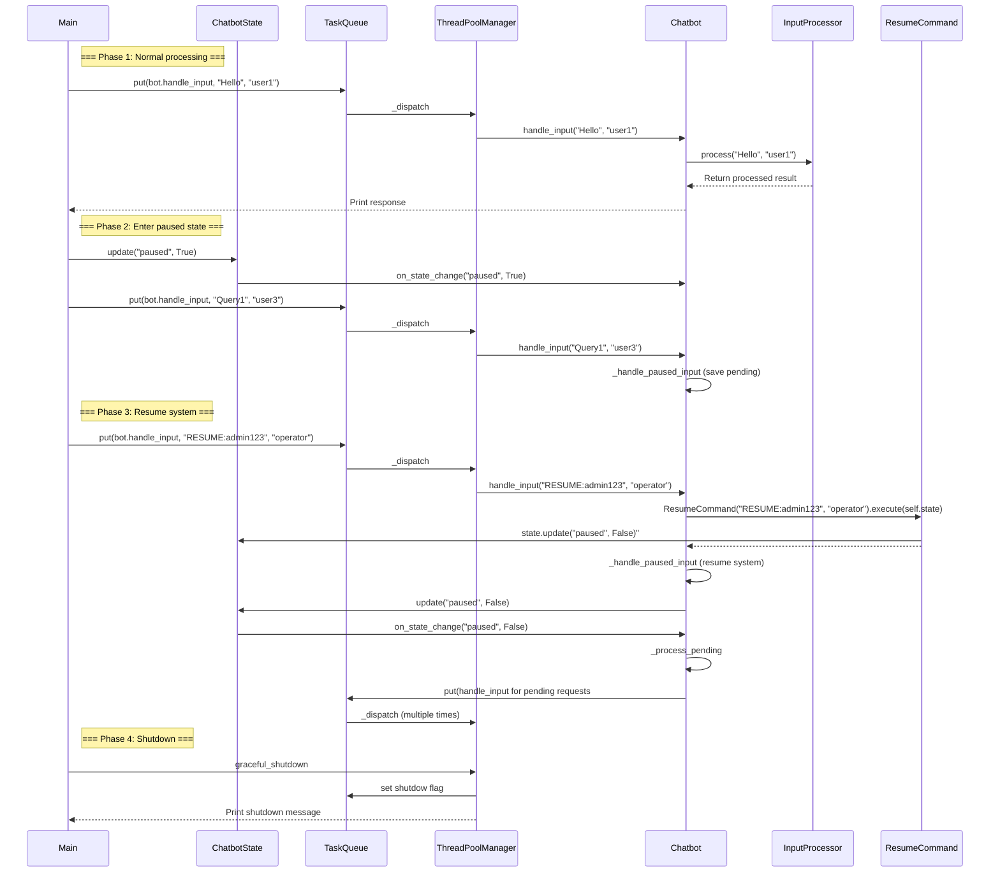

# 聊天机器人说明

### 业务功能说明
#### 流程图

#### 功能说明
1. 开始对话：用户可以随时开始与系统对话。

2. 发送消息：
   - 用户发送消息给系统。
   - 如果系统未暂停，直接处理消息并回复用户。
   - 如果系统处于暂停状态，消息将被保存为待处理请求。

3. 暂停与恢复：
   - 当系统被暂停时，所有新消息都会被暂时保存。
   - 管理员可以发送特殊命令来恢复系统。
   - 恢复后，系统会自动处理所有保存的待处理请求。

4. 结束对话：用户可以随时结束对话，或等待系统回复后继续对话。


#### 执行结果
```

=== Phase 1: Normal processing ===
[BOT] user1: Processed: Hello
[BOT] user2: Processed: Check status

=== Phase 2: Enter paused state ===

=== Phase 3: Resume system ===
[SYSTEM] Processing 2 pending requests
[BOT] user3: Processed: Query1
[BOT] user4: Processed: Query2

=== Phase 4: Shutdown ===

[SHUTDOWN] Initiating graceful shutdown...
[SHUTDOWN] All resources released
```

### 代码结构说明

程序执行入口：[main.py](main.py)

#### 技术特性
- 多线程异步任务处理
- 可暂停/恢复的会话状态
- 命令模式实现操作解耦
- 优雅的系统关闭流程
- 请求积压处理机制


#### 类图


类说明：

[Chatbot](chatbot.py#Chatbot)：聊天机器人。用外部的处理器[InputProcessor](main.py#InputProcessor) 来处理用户输入。根据机器人状态[ChatbotState](chatbot.py#ChatbotState)决定如何处理用户输入（正常处理或保存待处理请求），支持暂停和恢复功能。当系统处于暂停状态时，管理员可以通过它来恢复系统，它会将相关的恢复信息存储到状态中。
- ChatbotState：管理聊天机器人的状态，使用状态模式存储和更新机器人状态。当状态发生变化时，通过观察者模式通知注册的监听者，使其能够响应状态变化。

[ResumeCommand](commands.py#ResumeCommand)：恢复操作是特殊操作，会改变系统状态，需显式声明。
- 命令模式适合声明撤销（Undo）、重做（Redo）、历史记录、异步等命令

[TaskQueue](task_executor.py#TaskQueue)：线程安全的任务队列，用于存储待处理任务，并支持多线程[ThreadPoolManager](task_executor.py#ThreadPoolManager)环境下的任务存取。使用观察者模式，当任务被添加时，可以通知注册的观察者（暂没用到）。同时，支持关闭队列以停止接收新任务。
- ThreadPoolManager：线程池管理器，负责管理任务的执行。它使用线程池来异步执行任务，支持任务派发和线程池的优雅关闭，确保任务被安全地停止并清理资源。

[InputProcessor](main.py#InputProcessor)：处理用户输入的策略类，负责具体的输入处理逻辑，在本示例中提供了一个简单的文本处理示例。


#### 时序图


