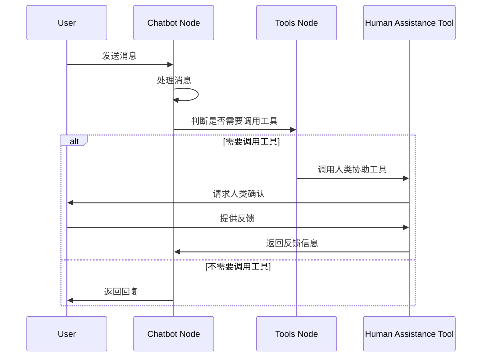
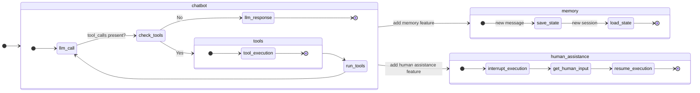

LangGraph 使用示例：构建聊天机器人。

教程地址：[Learn the basics | langchain](https://langchain-ai.github.io/langgraph/tutorials/introduction/)：Build language agents as graphs

代码参照：[chatbot_case](chatbot_case.py)

### 功能
涉及基础聊天功能和记忆功能，以及添加网页搜索工具、人类介入工具和自定义状态。

### 效果

问答示例：
```
User: Is John Doe's birthday on May 15th?
Chatbot: Let me verify that information with a human assistant.
Human Assistant: Is this correct? Name: John Doe, Birthday: May 15th
User: Yes
Chatbot: Information approved by human. John Doe's birthday is on May 15th.
```

时序图：



状态图：




步骤总结：
- 环境设置：安装langgraph、langsmith、langchain_anthropic等所需包，配置ANTHROPIC_API_KEY，注册 LangSmith 用于调试和性能优化。
- 构建基础聊天机器人：定义**含messages的State**类型，创建StateGraph，添加调用大语言模型（LLM）的chatbot**节点**，设置**入口**`set_entry_point("chatbot")`和**结束点**`set_finish_point("chatbot")`，编译并运行图以实现基本对话功能。
- 增强聊天机器人工具：安装tavily-python和langchain_community，配置TAVILY_API_KEY，定义搜索工具，修改 LLM 使其能调用工具，添加运行工具的节点`ToolNode(tools=tools)`和条件边`tools_condition`(只声明为调用)，实现根据 LLM 输出决定是否调用工具的功能。
- 添加聊天机器人记忆：创建**MemorySaver检查点**，在编译图时传入检查点；在获取响应时添加**thread_id标识对话线程**。实现聊天机器人跨对话保存和恢复状态，增强对话连贯性。
- 实现人类介入机制：在现有代码基础上添加**human_assistance工具**，该工具使用interrupt暂停执行并获取人类输入`human_response = interrupt({"query": query})`，在获取消息时通过Command对象传递人类输入以恢复执行`human_command = Command(resume={"data": human_response})
`，实现人类对复杂任务的指导和验证。
- 自定义状态：扩展State类型，添加name和birthday等字段，在human_assistance工具中利用Command更新状态，使聊天机器人可根据自定义状态执行复杂行为并进行信息审查。


### 问题点
这个例子很难懂，一些元素只声明却没有显示调用，像是冗余代码，不清楚实际作用。
- `command = Command(state_update={"name": name, "birthday": birthday})`，创建这个命令对象只是用于更新状态，像是对象创建后没有调用。
- `.add_conditional_edges("chatbot", tools_condition)`， `tools_condition`只是调用一下，看不出对全局有什么影响。

理解：

- 对于`command`，可以像 [chatbot.md](chatbot/chatbot.md)中实现的，通过方法来调用 `ResumeCommand(command, operator).execute(self.state)`，可以定位到行为。
    - 具体到例子中，state_update是属性，可以一眼看到更新的状态内容。使用状态的地方有很多，如工具节点、机器人聊天节点，都可能更新状态。而 Command(state_update) 只是声明，调用是不可见的，所以日志记录很重要、异常抛出很重要。可以订阅状态更新事件、加一个日志切面、或者定义一个类，在关键节点显示调用。
- python 中，函数是一等公民，可以不用类包装，可以作为参数传递给其他函数，tools_condition 是一个函数，内置逻辑。